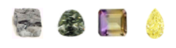

# Crystal Collector
This is another fun and interactive game for web browsers. This Web Application dynamically updates the HTML pages with the jQuery library.

* [Open](https://soniabradley.github.io/Crystal-Collector/) this on the browser, click on the crystals and start having fun.

# Built With
* [jQuery](http://jquery.com/) Makes things like HTML document traversal, event handling, animation, and Ajax much simpler with an easy-to-use API that works across a multitude of browsers.

* [Math.random]() Generates a number between 0 and 1, that isn't a whole number.

* [Math.floor]() Rounds down to the nearest whole number.

* [.hide()](https://www.w3schools.com/jquery/eff_hide.asp) Hides the selected elements.

* [.html](https://www.w3schools.com/jquery/html_html.asp) Changes the HTML to reflect changes in currentScore.

# To Do
* Add some styling!

# Author
Sonia Molina Bradley

